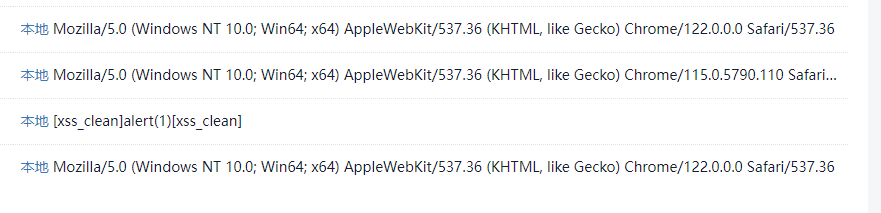
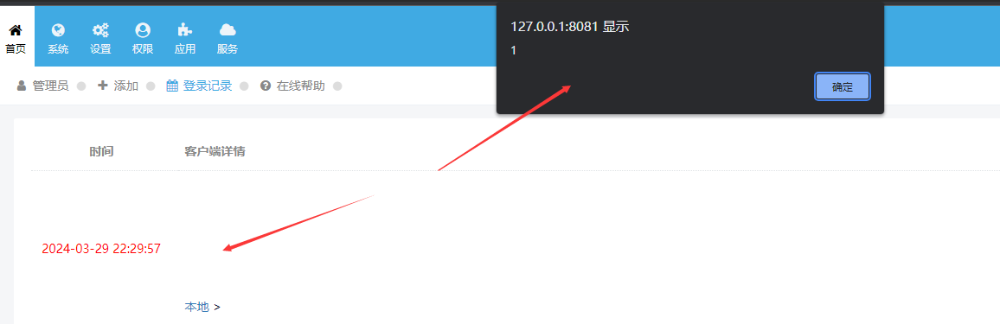

# XSS exists in Xunrui CMS v4.6.3 and below

## Vulnerability Type : 
Stored XSS

## Vulnerability Version :
Xunruicms<=v4.6.3

## Recurring environment
* Windows 11  
* PHP 7.4.3  
* Nginx 1.15.11

## Vulnerability Description AND recurrence:
(1) There is a filter for xss in the Security.php file in the catalog \XunRuiCMS\dayrui\Fcms\Library\.

But it only filters for normal xss scripts.
(2) Local environment can be found in the login situation of the user-agent filtering

(3) Tested using a mutated xss payload:
`User-Agent:"><svg/onload=alert(1)//`

(4) Go to background profile modification->login record, and found that triggering storage shape XSS

